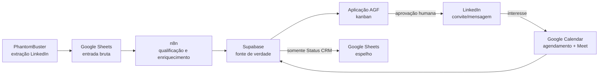

# AGF — estado atual da plataforma de geração de leads

**Atualizado em:** 22 de julho de 2026  
**Objetivo atual:** concluir o CRM web e o fluxo de descoberta, qualificação e
enriquecimento de leads para implementação de IA em finanças corporativas.

## Resumo

O CRM será uma aplicação web compartilhada pela equipe. O **Supabase** é a
fonte de verdade para autenticação, empresas, contatos, leads, etapas,
configurações e histórico. O **Google Sheets** permanece como entrada dos
resultados do PhantomBuster e espelho auditável do campo `Status CRM`.

As duas bases em escopo são:

1. **Vagas — leads quentes:** empresas com vaga financeira aberta, sinal atual
   de aumento de demanda.
2. **Middle market — prospecção proativa:** empresas com proxy de faturamento
   de R$ 50–500 milhões e sinal financeiro/operacional verificável.

M&A e startups estão pausados no fluxo ativo.



## O que está pronto

| Componente | Estado | Observação |
|---|---|---|
| Regras de qualificação | Documentadas | `LEAD_EXTRACTION_RULES.md` reúne portfólio, score, perfil e contato por porte. |
| Saved searches | Documentadas | `docs/LINKEDIN_SAVED_SEARCHES.md`. |
| Aplicação web | Em evolução | Login Supabase, kanban, drawer detalhado, configurações e atualização de etapa no banco. |
| Supabase | Conectado | Projeto e usuários iniciais já criados; credencial de serviço conectada ao n8n. |
| n8n | Conectado | Credenciais de Supabase, Sheets, Calendar de teste, Gemini e PhantomBuster disponíveis; workflows ainda em montagem. |
| PhantomBuster | Preparado | Conta de teste conectada ao LinkedIn. A ação de outbound permanece desligada. |
| Google Sheets | Operacional | Abas de entrada e saída existem; falta ativar o espelho seguro de status. |
| Google Calendar | Desenhado | Agendamento nativo definido; a agenda de teste será trocada pela do Giulio antes de produção. |

## Regras comerciais vigentes

### Perfil obrigatório

Antes de entrar no CRM, o contato precisa ter localização no Brasil, pelo menos
100 conexões e ação `Conectar` disponível. Perfil incompleto, inconsistente ou
sem evidência suficiente é descartado ou enviado à revisão, não ao kanban.

### Pontuação

`score-base = porte (0–3) + urgência/momento (0–3) + decisor (0–2)`.

- Vagas entram com score-base `>=3`.
- Middle market entra com score-base `>=5`.
- Economia real adiciona `+2` fora do eixo Rio–SP, `+1` no eixo e `0` nos
  demais casos. O score comercial máximo é **10**, mas o bônus não muda o
  corte técnico.

### Contato prioritário

| Base / porte | Contato preferencial | Fallback |
|---|---|---|
| Vagas — grande | líder ou gerente da área da vaga | CEO/CFO/dono se não houver líder aderente validado |
| Vagas — média/pequena | CEO, CFO ou liderança financeira | líder da área; recrutador por último |
| Middle — grande | líder ou gerente da área | CEO/CFO/dono se não houver líder aderente validado |
| Middle — média/pequena | dono, CEO, CFO ou head | liderança financeira relacionada ao sinal |

O Giulio é o condutor padrão. Outro sócio só é recomendado com evidência direta
e excepcional de fit setorial, histórico ou ecossistema.

## Pipeline da aplicação

`Prontos para enviar → Aprovado → Enviar convite → Convite enviado → Enviar mensagem → Em conversa → Agendamento → Call marcada → Concluído`

- Todos os usuários autenticados veem a mesma base e podem alterar as
  configurações operacionais.
- Um card por empresa fica ativo; sinal extremamente forte posterior pode
  reabrir o histórico com evidência explícita.
- A etapa atual é gravada no Supabase e será espelhada exclusivamente na coluna
  `Status CRM` da linha correspondente no Sheets.
- O card expandido mostra contexto, evidências, composição do score, histórico
  e rascunho aprovado.

## Mensagem-base aprovada

```text
{Nome}, tudo bem? Obrigado por aceitar o convite.

Vi {trigger da empresa}. Imagino que usar AI de verdade no financeiro, sem virar projeto eterno, esteja na pauta aí também.

Montei a AGF exatamente para isso. Contamos com profissionais das melhores consultorias do Brasil, que atuam no dia a dia da empresa, do operacional ao estratégico, criando automações no caminho.

Eu venho de 10+ anos entre banking e corporate development, e fundei uma empresa na qual levantei recursos com investidores institucionais.

Topa 15-30 minutos para eu me apresentar rapidamente?
```

## Agendamento

No estágio `Agendamento`, o lead recebe o link do agendamento nativo do Google
Calendar. A pessoa escolhe um slot de 30 minutos disponível entre 09:00 e
20:00, com início apenas em `:00`, `:15`, `:30` ou `:45`. O Calendar cria Meet,
reserva a agenda e envia confirmação. O título será:

`AGF - Giulio / Empresa - Nome do lead`

## Próximos passos de construção

1. Aplicar a migration de score 0–10 no Supabase.
2. Concluir e testar o workflow de espelho de status para Vagas e Middle.
3. Construir o workflow de ingestão: Sheets → filtros → Gemini → Supabase.
4. Ligar o botão de extração extra ao Webhook seguro do n8n.
5. Preparar os workflows inativos de convite/mensagem e agendamento.
6. Realizar piloto com os sócios e somente depois avaliar ativação de outreach.

Detalhes de payloads e de montagem dos workflows estão em
`docs/N8N_INTEGRATION_CONTRACT.md`.
